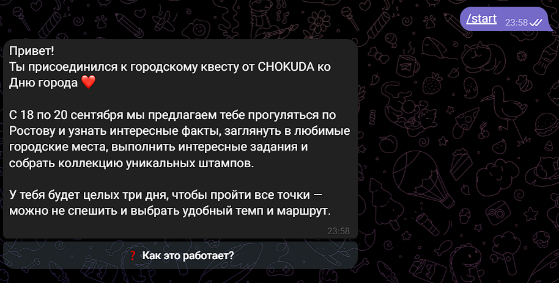
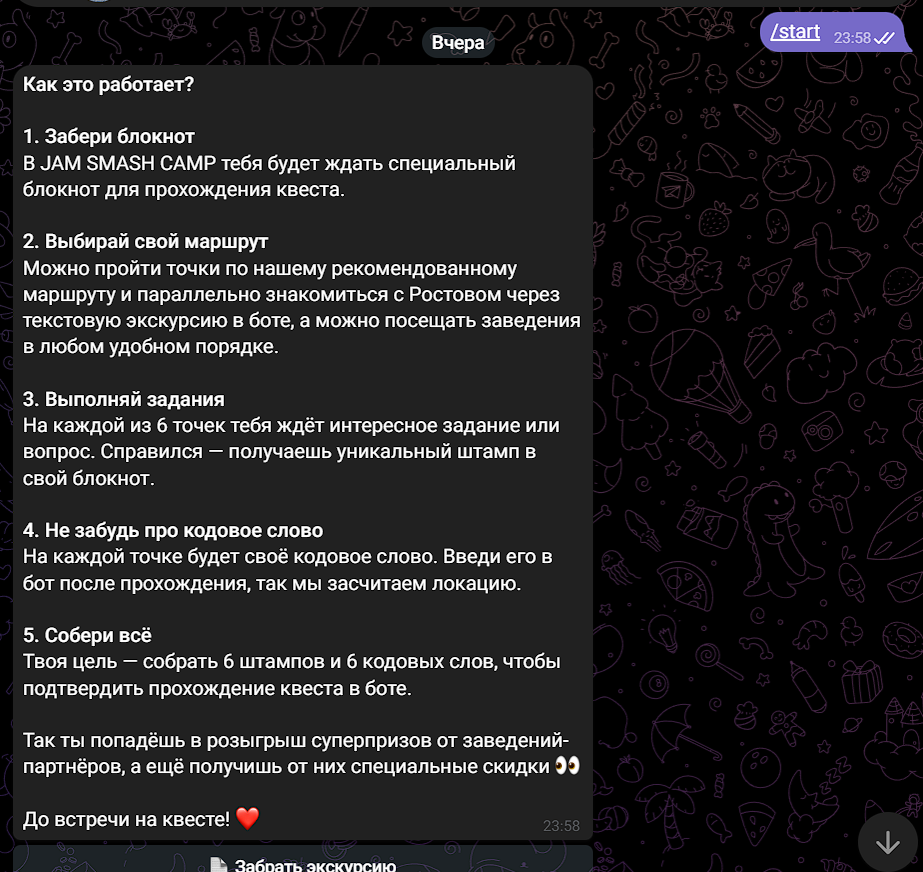
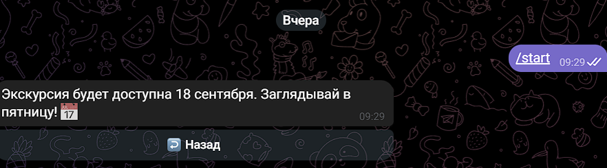
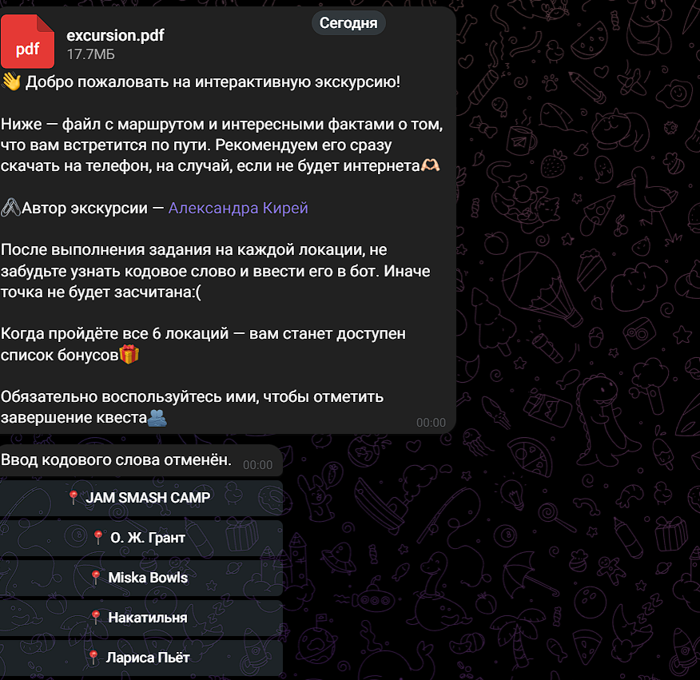
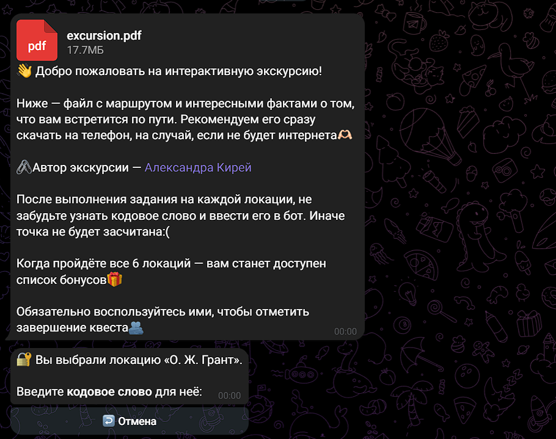
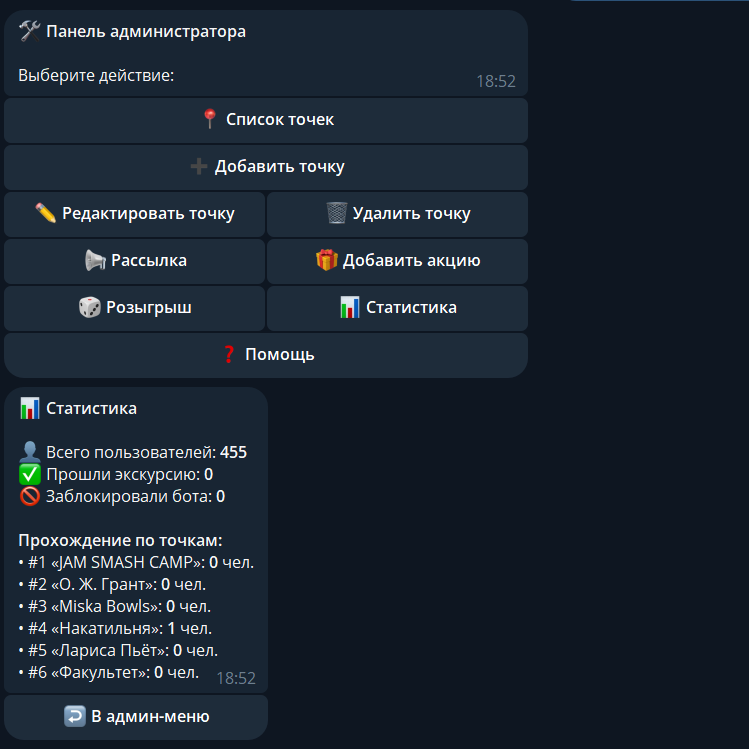

# Telegram-бот для городского квеста

Бот для интерактивной экскурсии: выдаёт PDF с маршрутом, принимает кодовые слова, ведёт прогресс, сохраняет участников в базу, отправляет бонусы после прохождения и выбирает победителя розыгрыша.

## Возможности

- **Отложенный доступ к экскурсии** — PDF открывается автоматически в заданное время (например, 18 сентября в 00:00 МСК). До этого момента бот показывает «Экскурсия будет доступна 18 сентября»
- **Выдача PDF** с экскурсией по кнопке «Забрать экскурсию»
- **6 локаций** с кодовыми словами
- **Табло локаций** — гость сам выбирает, какую локацию проходить
- **Проверка кодовых слов** и прогресс (1/6, 2/6...)
- **Кнопка «🏆 КВЕСТ ПРОЙДЕН»** после прохождения всех локаций
- **Бонусы от заведений** — отправляются сразу после завершения квеста
- **Сохранение участников** в SQLite
- **Админка** через `/admin` — меню с кнопками
- **Управление точками**: добавить / редактировать / удалить
- **Рассылка** подписчикам и **розыгрыш** победителей
- **Статистика**: пользователи, прохождения по точкам, блокировки
- **Несколько админов** (список в `.env`)

## Стек

- Python 3.11+
- aiogram 3.x
- SQLite
- python-dotenv
- APScheduler

## Скриншоты

| Приветствие | Как это работает | Отложенный доступ |
|---|---|---|
|  |  |  |

| Табло локаций | Ввод кодового слова |
|---|---|
|  |  |

| Админ-панель |
|---|
|  |

## Быстрый запуск

1. Клонировать репозиторий
2. `pip install -r requirements.txt`
3. Скопировать `.env.example` в `.env` и заполнить:
   - `BOT_TOKEN` — от @BotFather
   - `ADMIN_CHAT_ID` — твой Telegram ID (можно несколько через запятую)
   - `EXCURSION_FILE_PATH` — путь к PDF
   - `DATABASE_PATH` — путь к SQLite (по умолчанию `data/bot.db`)
   - `DAILY_BROADCAST_HOUR` — час авторассылки (по умолчанию 10)
4. Положить PDF в `files/excursion.pdf`
5. `python bot.py`

## Команды

### Пользовательские

| Команда | Назначение |
|---|---|
| `/start` | Начать квест |
| `/help` | Справка |

### Административные

| Команда | Назначение |
|---|---|
| `/admin` | Админ-меню с кнопками |
| `/add_point` | Добавить точку |
| `/del_point` | Удалить точку |
| `/list_points` | Список точек и кодовых слов |
| `/add_promo` | Добавить акцию |
| `/broadcast` | Рассылка подписчикам |
| `/draw` | Розыгрыш победителя |
| `/stats` | Статистика |

## Структура проекта
excursion-quest-bot/
├── bot.py # приложение: Settings, Database, handlers
├── requirements.txt # зависимости
├── .env.example # шаблон конфигурации
├── .gitignore # исключения Git
├── LICENSE # лицензия MIT
├── docs/
│ └── screenshots/ # скриншоты для README
├── files/
│ └── excursion.pdf # PDF с экскурсией
├── data/
│ └── bot.db # SQLite (создаётся автоматически)
└── README.md # документация

## Как это работает

1. Гость отправляет `/start` → видит приветствие и кнопку «Как это работает?».
2. Нажимает «Как это работает?» → читает инструкцию → нажимает «Забрать экскурсию».
3. Если экскурсия ещё не открыта (до заданной даты) — бот показывает «Экскурсия будет доступна 18 сентября».
4. После открытия — гость получает PDF с маршрутом.
5. Нажимает «▶️ Начать квест» → видит табло с локациями.
6. Выбирает локацию → вводит кодовое слово → локация засчитывается.
7. Когда все 6 локаций пройдены → появляется кнопка «🏆 КВЕСТ ПРОЙДЕН».
8. Нажимает → получает бонусы от заведений-партнёров.
9. Админ может добавлять акции, делать рассылку и проводить розыгрыш через `/admin`.

## Отложенный доступ

В файле `bot.py` есть константа:

```python
EXCURSION_AVAILABLE_AT: datetime = datetime(2026, 9, 18, 0, 0, 0, tzinfo=MSK)

PDF открывается автоматически в указанное время по московскому времени. До этого момента бот показывает сообщение «Экскурсия будет доступна 18 сентября».

Деплой
Арендовать VPS (Aeza, Timeweb и т.п.) с локацией за границей (Германия, Нидерланды).

Установить Python 3.11+, git.

Клонировать репозиторий, создать venv, установить зависимости.

Настроить .env, положить PDF.

Создать systemd-сервис для автозапуска.

Лицензия
MIT